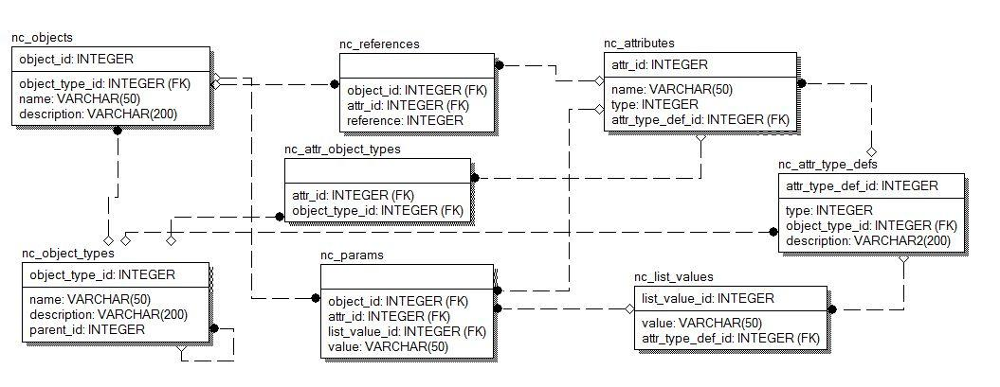

# db-structure

## Content
- [Data Base Schema.](#data-base-schema)
- [Data Base Schema.](#table-description)
    - [Table 1. __nc_objects__.](#table-1-nc_objects)
    - [Table 2. __nc_object_types__.](#table-2-nc_object_types)
    - [Table 3. __nc_attributes__.](#table-3-nc_attributes)
    - [Table 4. __nc_attr_object_types__.](#table-4-nc_attr_object_types)
    - [Table 5. __nc_attr_type_defs__.](#table-5-nc_attr_type_defs)
    - [Table 6. __nc_references__.](#table-6-nc_references)
    - [Table 7. __nc_params__.](#table-7-nc_params)
    - [Table 8. __nc_list_values__.](#table-8-nc_list_values)
- [Clarification.](#clarification)
- [Required Tables.](#required-tables)
    - [nc_object_types](#nc_object_types)
    - [nc_attr_type_defs](#nc_attr_type_defs)
    - [nc_list_values](#nc_list_values)
    - [nc_attributes](#nc_attributes)
    - [nc_attr_object_types](#nc_attr_object_types)

## Data Base Schema.

## Table Description.
It consists of 8 tables.

### Table 1. __nc_objects__.
| name | type | additional |
| --- | --- | ---
| object_id | int unsigned | primary key |
| name | varchar(50) | not null |
| object_type_id | int unsigned | foreign key |
| description | varchar(200) | - |

### Table 2. __nc_object_types__.
| name | type | additional |
| --- | --- | ---
| object_type_id | int unsigned | primary key
| name | varchar(50) | not null |
| parent_id | int unsigned | not null |
| description | varchar(200) | - |

### Table 3. __nc_attributes__.
| name | type | additional |
| --- | --- | ---
| attr_id | int unsigned | primary key |
| name | varchar(50) | not null |
| attr_type_def_id | int unsigned | foreign key |

### Table 4. __nc_attr_object_types__.     
| name | type | additional |
| --- | --- | ---
| attr_id | int unsigned | foreign key |
| object_type_id | int unsigned | foreign key |

### Table 5. __nc_attr_type_defs__.
| name | type | additional |
| --- | --- | ---
| attr_type_def_id | int unsigned | primary key |
| type | int | not null |
| object_type_id | int unsigned | foreign key |
| description | varchar(200) | - |

### Table 6. __nc_references__.
| name | type | additional |
| --- | --- | ---
| attr_id | int unsigned | foreign key |
| object_id | int unsigned | foreign key |
| reference | int unsigned | not null |

### Table 7. __nc_params__.
| name | type | additional |
| --- | --- | ---
| attr_id | int unsigned | not null, foreign key |
| object_id | int unsigned | not null, foreign key |
| value | varchar(50) | - |
| list_value_id | int unsigned | foreign key |

### Table 8. __nc_list_values__.
| name | type | additional |
| --- | --- | ---
| list_value_id | nt unsigned | primary key |
| value | varchar(50) | not null |
| attr_type_def_id | nt unsigned | foreign key |

## Clarification.
 - All **Primary Keys** have to be auto-incremented;
 - **nc_references** table: at _reference_ field stores __ID__ Object. 
     
     If in the **nc_references** table exist the row, so it means that the Object (_object_id_) has the reference to another Object (_reference_) by the Attribute (_attr_id_). 
     
     For example, the Order (_object_id_) has a link to the phone number (_reference_) in the 'Phone Number' Attribute (_attr_id_).
 - **nc_attr_type_defs** table: the table stores information about the attribute type. The _object_type_id_ field is required for _reference_ Attributes.
 - **nc_params** table: the _list_value_id_ field can only be filled when the Attribute (_attr_id_) is 'List' type (_type_ = 6).

## Required Tables.
Сlarification are shown in parentheses.

### __nc_object_types__
| object_type_id | name | parent_id | description|
| --- | --- | --- | ---
| 1 | All | 0 | Based Object Type|
| 2 | Abstract Order Object Type | 1 (All) | Abstract Оbject Type for all Product Orders |
| 3 | Abstract Instance Object Type | 1 (All) | Abstract Оbject Type for all Product Instances |
| 4 | Internet Order Object Type | 2 (Abstract Order Object Type) | - |
| 5 | Video Order Object Type | 2 (Abstract Order Object Type) | - |
| 6 | Mobile Order Object Type | 2 (Abstract Order Object Type) | - |
| 7 | Internet Instance Object Type | 3 (Abstract Instance Object Type) | - |
| 8 | Video Instance Object Type | 3 (Abstract Instance Object Type) | - |
| 9 | Mobile Instance Object Type | 3 (Abstract Instance Object Type) | - |
| 10 | Phone Number | 1 (All) | Phone Number Оbject Type |

### __nc_attr_type_defs__
| attr_type_def_id | type | object_type_id | description |
| --- | --- | --- | ---
| 1 | 0 (Text) | - | For any Text attribute | 
| 2 | 2 (Number) | - | For any Number attribute |
| 3 | 3 (Decimal) | - | For any Decimal attribute |
| 4 | 4 (Date) | - | For any Date attribute |
| 5 | 6 (List) | - | Access Type Values |
| 6 | 6 (List) | - | Service Type Values |
| 7 | 6 (List) | - | Order Status Values |
| 8 | 9 (Reference) | 10 (Phone Number) |  For any Reference to Phone Number OT |

:large_orange_diamond: Date type will store as Text in day-mounth-year format. Example: 8-Apr-2020.

### __nc_list_values__
| list_value_id | value | attr_type_def_id |
| --- | --- | ---
| 1 | XDSL | 5 (Access Type Value) |
| 2 | GPON | 5 (Access Type Value) |
| 3 | Postpaid | 6 (Service Type Value) |
| 4 | Prepaid | 6 (Service Type Value) |
| 5 | Entering | 7 (Order Status Value) |
| 6 | Completed | 7 (Order Status Value) |
| 7 | Cancelled | 7 (Order Status Value) |
<!-- 
| # | New | # (Order Aim Value) | 
| # | Disconnect | # (Order Aim Value) | 
| # | Modify | # (Order Aim Value) | 
-->

### __nc_attributes__
| attr_id | name | attr_type_def_id |
| --- | --- | ---
| 1 | Due Date | 4 (Any Date attribute) |
| 2 | Phone Number | 8 (Any Reference to Phone Number OT) |
| 3 | Access Type | 5 (Access Type Values) |
| 4 | Download Speed | 1 (Any Text attribute) |
| 5 | Service Type | 6 (Service Type Values) |
| 6 | Suspend Reason | 1 (Any Text attribute) |
| 7 | Activation Period | 2 (Any Number attribute) |
| 8 | Product Price | 3 (Any Decimal attribute) |
| 9 | Order Status | 7 (Order Status Values) |

Attention

<!-- 
| # | Order Aim | # (Order Aim Values) | 
-->
### __nc_attr_object_types__
| attr_id | object_type_id |
| --- | --- 
| 1 (Due Date) | 2 (Abstract Order Object Type) |
| 2 (Phone Number) | 6 (Mobile Order Object Type) |
| 3 (Access Type) | 4 (Internet Order Object Type) |
| 4 (Download Speed) | 4 (Internet Order Object Type) |
| 5 (Service Type) | 6 (Mobile Order Object Type) |
| 6 (Suspend Reason) | 5 (Video Order Object Type) |
| 7 (Activation Period) | 2 (Abstract Order Object Type) |
| 8 (Product Price) | 2 (Abstract Order Object Type) |
| 9 (Order Status) | 2 (Abstract Order Object Type) |